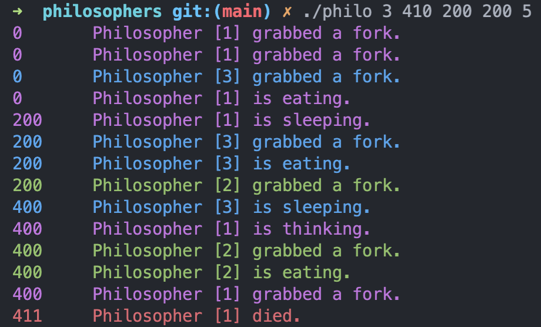
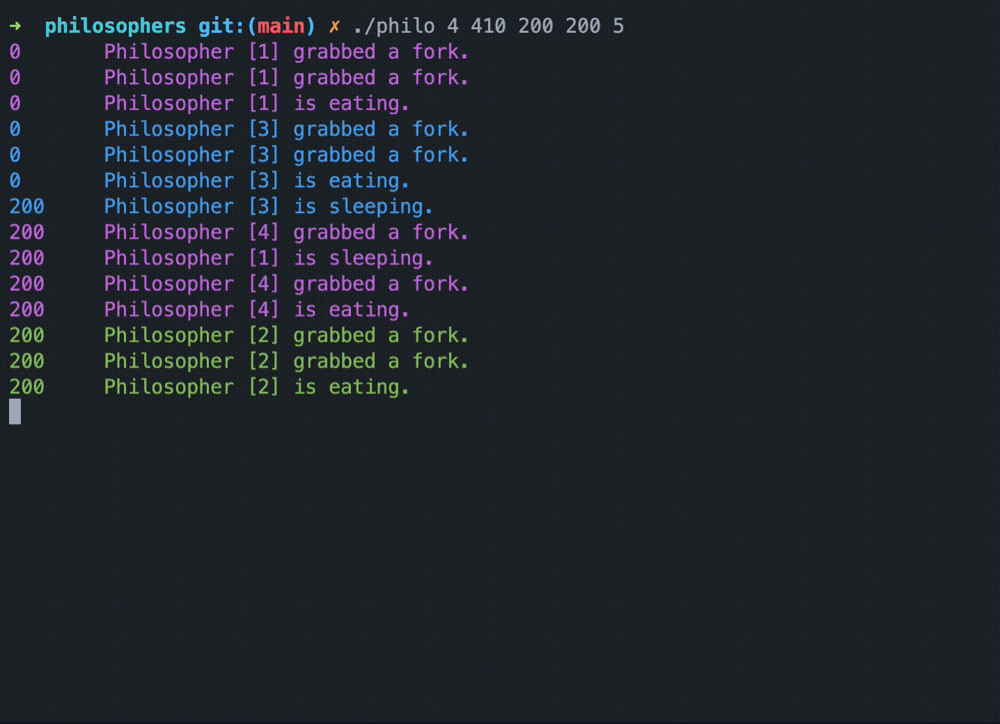

# <h1 align="center"><a href="https://github.com/AtibQur/philosophers/blob/main/exercise_pdf/en.subject.pdf" target="_blank">Philosophers</a>🍝🍴</h1>

<h2> Description Philosophers</h2>
This projects involves making use of threads and mutexes. 
By precisely timing a group of philosphers on when to pick a fork and spaghetti without dying from hunger.
  
To succeed this assignement:
<li>One or more philosophers sit at a round table.
There is a large bowl of spaghetti in the middle of the table.</li>
<li>The philosophers alternatively eat, think, or sleep.
While they are eating, they are not thinking nor sleeping;
while thinking, they are not eating nor sleeping;
and, of course, while sleeping, they are not eating nor thinking.</li>
<li>There are also forks on the table. There are as many forks as philosophers.</li>
<li>• There are also forks on the table. There are as many forks as philosophers.</li>
<li>When a philosopher has finished eating, they put their forks back on the table and
start sleeping. Once awake, they start thinking again. The simulation stops when
a philosopher dies of starvation.</li>
<li>Every philosopher needs to eat and should never starve.</li>
<li>Philosophers don’t speak with each other.</li>
<li>Philosophers don’t know if another philosopher is about to die.</li>
<li>No need to say that philosophers should avoid dying!</li>

<h2>Installation ⚙️</h2>
*To build the programm there is only a few steps: First of all, you can download the repository through the following steps in any shell of your preference:*
 
<pre>
git@github.com:AtibQur/philosophers.git
cd philosophers
make
</pre>
These commands will compile everything and a executable <em>"philo"</em> should be created.
 
<h2>Usage 🛠️</h2>

To compile the program, run the following command:

<pre>
cd philosophers && make
</pre>
After creating the executable, the function is ready for use. This function only takes integers and will return errors if a non numeric character is used.  
The program takes 4 or 5 arguments:  
1: ./philo  
2: amount of philosopher 
3: time to eat 
4: time to sleep 
5: amount of meals to eat (optional) 
 
<pre>
./philo 3 410 200 200 5 --> will fail
</pre>

<pre>
./philo 4 410 200 200 5 --> will run till amount of times to eat is true
</pre>

<h2>3rd party helpers</h2>
educative  --> https://www.educative.io/answers/how-to-create-a-simple-thread-in-c
MichelleJiam tester --> https://github.com/MichelleJiam/LazyPhilosophersTester/tree/9819a70a3f6bab412d6615d26d625d648fa3695a
Dining philosophers problem wikipedia --> https://en.wikipedia.org/wiki/Dining_philosophers_problem